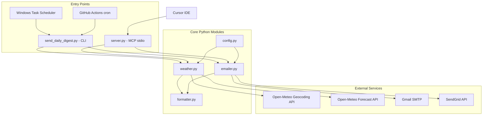
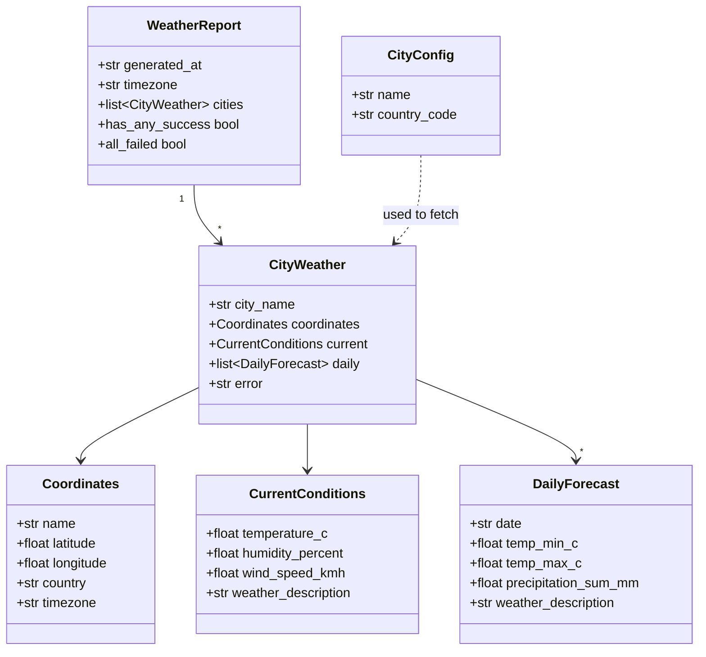

# Weather Email MCP — Design Document

A simple reference for explaining this project to your team.

---

## 1. What this project does

This project sends a **daily weather digest email** for three Indian cities:

| City   | Country |
|--------|---------|
| Delhi  | IN      |
| Mumbai | IN      |
| Nagpur | IN      |

It also exposes an **MCP server** so Cursor (or any MCP client) can fetch weather or send email on demand.

**Recipient email:** `amol.eng@gmail.com` (configurable)

**Weather source:** [Open-Meteo](https://open-meteo.com/) — free, no API key  
**Email delivery:** Gmail SMTP or SendGrid (configured in `.env`)

---

## 2. High-level architecture

The system has **two entry points** that share the same core Python modules:



### Why two entry points?

| Entry point | When it runs | Purpose |
|-------------|--------------|---------|
| `server.py` | On demand (when Cursor calls a tool) | Interactive weather lookup + manual email |
| `send_daily_digest.py` | Scheduled (daily at 7 AM IST) | Automatic email without opening Cursor |

MCP servers use **stdio transport** — they start only when invoked. They cannot run 24/7 in the background. That is why scheduling uses a separate CLI script.

---

## 3. Folder structure

```
c:\SB\MCP\
│
├── server.py                 # MCP server — exposes 3 tools to Cursor
├── send_daily_digest.py      # Scheduled job entry point
├── weather.py                # Open-Meteo API client + data models
├── formatter.py              # Builds text / HTML / Markdown output
├── emailer.py                # Sends email via SMTP or SendGrid
├── config.py                 # Cities, env vars, constants
│
├── requirements.txt          # Python dependencies
├── .env                      # Secrets (not committed) — SMTP/SendGrid keys
├── .env.example              # Template for .env
├── README.md                 # Setup and run instructions
├── DESIGN.md                 # This document
│
├── examples/
│   └── run_tests.py          # Smoke tests (weather fetch + optional email)
│
├── scripts/
│   └── register_scheduled_task.ps1   # Registers Windows daily task
│
├── logs/
│   └── digest.log            # Runtime log from scheduled runs
│
├── .github/workflows/
│   └── daily-weather.yml     # Cloud cron (GitHub Actions, 7 AM IST)
│
└── .venv/                    # Python virtual environment (local only)
```

### File responsibilities (one line each)

| File | Responsibility |
|------|----------------|
| `config.py` | Load `.env`, define default cities, API URLs |
| `weather.py` | Call Open-Meteo, build `WeatherReport` object |
| `formatter.py` | Turn `WeatherReport` into email/Markdown/HTML |
| `emailer.py` | Send formatted report via Gmail or SendGrid |
| `server.py` | Register MCP tools, wire modules together |
| `send_daily_digest.py` | Fetch + email + log + exit code for scheduler |

---

## 4. Python technology stack

| Layer | Library | Version |
|-------|---------|---------|
| Language | Python | 3.12+ |
| MCP framework | `mcp` (FastMCP) | >= 1.2.0 |
| HTTP client | `httpx` | >= 0.27.0 |
| Email (SendGrid) | `sendgrid` | >= 6.11.0 |
| Email (Gmail) | `smtplib` (stdlib) | built-in |
| Config | `python-dotenv` | >= 1.0.0 |

---

## 5. Classes and data models

This project uses **dataclasses** (not traditional OOP classes with methods). Data flows as plain structures between modules.

### 5.1 `config.py`

#### `CityConfig` (frozen dataclass)
Represents one city to fetch weather for.

| Field | Type | Example |
|-------|------|---------|
| `name` | `str` | `"Delhi"` |
| `country_code` | `str` | `"IN"` |

**Default list:** `DEFAULT_CITIES` = Delhi, Mumbai, Nagpur (all `country_code="IN"`)

#### `SmtpConfig` (frozen dataclass)
SMTP connection settings from `.env`.

| Field | Type | Default |
|-------|------|---------|
| `host` | `str` | `smtp.gmail.com` |
| `port` | `int` | `587` |
| `user` | `str` | from `SMTP_USER` |
| `password` | `str` | from `SMTP_PASS` |
| `secure` | `bool` | `false` (uses STARTTLS) |

#### Type alias
- `EmailProvider` = `"sendgrid"` | `"smtp"`

---

### 5.2 `weather.py`

#### `Coordinates` (frozen dataclass)
Result of geocoding a city name to lat/lon.

| Field | Type | Description |
|-------|------|-------------|
| `name` | `str` | Resolved city name |
| `latitude` | `float` | WGS84 latitude |
| `longitude` | `float` | WGS84 longitude |
| `country` | `str` | Country name |
| `timezone` | `str` | IANA timezone (e.g. `Asia/Kolkata`) |
| `elevation` | `float \| None` | Meters above sea level |

#### `CurrentConditions` (dataclass)
Live weather right now.

| Field | Type | Open-Meteo field |
|-------|------|------------------|
| `temperature_c` | `float \| None` | `temperature_2m` |
| `apparent_temperature_c` | `float \| None` | `apparent_temperature` |
| `humidity_percent` | `float \| None` | `relative_humidity_2m` |
| `wind_speed_kmh` | `float \| None` | `wind_speed_10m` |
| `wind_direction_deg` | `float \| None` | `wind_direction_10m` |
| `precipitation_mm` | `float \| None` | `precipitation` |
| `cloud_cover_percent` | `float \| None` | `cloud_cover` |
| `weather_code` | `int \| None` | `weather_code` (WMO) |
| `weather_description` | `str` | Mapped from WMO code |
| `observed_at` | `str \| None` | `time` (ISO 8601) |

#### `DailyForecast` (dataclass)
One day in the 3-day forecast.

| Field | Type | Open-Meteo field |
|-------|------|------------------|
| `date` | `str` | `daily.time` |
| `temp_min_c` | `float \| None` | `temperature_2m_min` |
| `temp_max_c` | `float \| None` | `temperature_2m_max` |
| `precipitation_sum_mm` | `float \| None` | `precipitation_sum` |
| `wind_max_kmh` | `float \| None` | `wind_speed_10m_max` |
| `weather_code` | `int \| None` | `weather_code` |
| `weather_description` | `str` | Mapped from WMO code |
| `sunrise` | `str \| None` | `sunrise` |
| `sunset` | `str \| None` | `sunset` |

#### `CityWeather` (dataclass)
Weather for one city — success or error.

| Field | Type | Description |
|-------|------|-------------|
| `city_name` | `str` | Requested city |
| `coordinates` | `Coordinates \| None` | Set on success |
| `current` | `CurrentConditions \| None` | Set on success |
| `daily` | `list[DailyForecast]` | 3-day forecast |
| `error` | `str \| None` | Error message if fetch failed |

#### `WeatherReport` (dataclass)
Top-level report containing all cities.

| Field | Type | Description |
|-------|------|-------------|
| `generated_at` | `str` | Human-readable timestamp |
| `timezone` | `str` | Report timezone |
| `cities` | `list[CityWeather]` | One entry per city |

**Properties:**
- `has_any_success` — at least one city fetched OK
- `all_failed` — every city failed

---

### 5.3 Data model relationship diagram



---

## 6. Key functions (by module)

### `config.py`

| Function | Returns | Purpose |
|----------|---------|---------|
| `get_env(name, default)` | `str \| None` | Read optional env var |
| `required_env(name)` | `str` | Read required env var (raises if missing) |
| `get_email_provider()` | `"sendgrid" \| "smtp"` | Pick email backend from `.env` |
| `get_from_email()` | `str` | Sender address |
| `get_to_email()` | `str` | Recipient (default: amol.eng@gmail.com) |
| `get_smtp_config()` | `SmtpConfig` | Gmail/SMTP settings |
| `get_sendgrid_api_key()` | `str` | SendGrid API key |
| `get_digest_timezone()` | `str` | Default: `Asia/Kolkata` |
| `ensure_log_dir()` | `Path` | Creates `logs/` folder |

### `weather.py`

| Function | Returns | Purpose |
|----------|---------|---------|
| `geocode_city(name, country_code)` | `Coordinates` | City name → lat/lon |
| `fetch_forecast(coords)` | `(CurrentConditions, list[DailyForecast])` | Weather for coordinates |
| `fetch_city_weather(city)` | `CityWeather` | Full fetch for one city (handles errors) |
| `build_weather_report(cities, timezone)` | `WeatherReport` | Fetch all cities |
| `wmo_description(code)` | `str` | WMO weather code → human text |
| `_request_json(url, params)` | `dict` | HTTP GET with 1 retry |

### `formatter.py`

| Function | Returns | Purpose |
|----------|---------|---------|
| `build_email_subject(report)` | `str` | e.g. `Daily Weather — Delhi, Mumbai, Nagpur — 14 Jun 2026` |
| `format_report_text(report)` | `str` | Plain-text email body |
| `format_report_html(report)` | `str` | HTML email with tables |
| `format_report_markdown(report)` | `str` | Markdown (for MCP tool responses) |

### `emailer.py`

| Function | Returns | Purpose |
|----------|---------|---------|
| `send_weather_email(report, to_email?)` | `str` | Main send function — picks SMTP or SendGrid |
| `_send_via_smtp(...)` | `str` | Gmail / generic SMTP |
| `_send_via_sendgrid(...)` | `str` | SendGrid REST API |

### `server.py` (MCP tools)

| Tool | Input | Output | Sends email? |
|------|-------|--------|--------------|
| `get_weather_report` | none | Markdown report | No |
| `send_weather_email_now` | none | Markdown + send status | Yes |
| `get_city_weather` | `city_name`, `country_code` | Markdown for one city | No |

### `send_daily_digest.py`

| Function | Returns | Purpose |
|----------|---------|---------|
| `setup_logging()` | `Logger` | File + console logging |
| `main()` | `int` | Exit 0 = success, 1 = failure (for Task Scheduler) |

---

## 7. External APIs

### 7.1 Open-Meteo Geocoding API

**Purpose:** Convert city name to latitude/longitude.

| Property | Value |
|----------|-------|
| Base URL | `https://geocoding-api.open-meteo.com/v1/search` |
| Method | `GET` |
| Auth | None (free) |
| License | CC BY 4.0 (attribution required) |

**Example request:**
```
GET https://geocoding-api.open-meteo.com/v1/search?name=Delhi&count=5&language=en&format=json
```

**Key response fields:**
```json
{
  "results": [{
    "name": "Delhi",
    "latitude": 28.65,
    "longitude": 77.23,
    "country": "India",
    "country_code": "IN",
    "timezone": "Asia/Kolkata"
  }]
}
```

**Important:** We filter by `country_code=IN` so "Delhi" resolves to India, not Delhi, US.

---

### 7.2 Open-Meteo Forecast API

**Purpose:** Get current weather + 3-day forecast for coordinates.

| Property | Value |
|----------|-------|
| Base URL | `https://api.open-meteo.com/v1/forecast` |
| Method | `GET` |
| Auth | None (free) |

**Example request:**
```
GET https://api.open-meteo.com/v1/forecast
  ?latitude=28.65
  &longitude=77.23
  &timezone=Asia/Kolkata
  &current=temperature_2m,apparent_temperature,relative_humidity_2m,...
  &daily=weather_code,temperature_2m_max,temperature_2m_min,...
  &forecast_days=3
```

**Weather codes:** Numeric WMO codes (0 = clear, 61 = slight rain, 95 = thunderstorm, etc.). Mapped in `WMO_WEATHER_CODES` dict in `weather.py`.

---

### 7.3 Gmail SMTP (primary email option)

| Property | Value |
|----------|-------|
| Host | `smtp.gmail.com` |
| Port | `587` (STARTTLS) |
| Auth | Gmail address + App Password |
| Env vars | `SMTP_USER`, `SMTP_PASS`, `FROM_EMAIL` |

**Flow:**
1. Connect to SMTP server
2. `STARTTLS` encryption
3. Login with app password
4. Send multipart email (plain text + HTML)

---

### 7.4 SendGrid API (alternative email option)

| Property | Value |
|----------|-------|
| SDK | `sendgrid` Python package |
| Auth | API key in `SENDGRID_API_KEY` |
| Requirement | `FROM_EMAIL` must be a verified sender in SendGrid dashboard |

**Flow:**
1. Build `Mail` object with subject, text, HTML
2. `SendGridAPIClient(api_key).send(message)`
3. Check HTTP status code (202 = accepted)

---

## 8. End-to-end data flow

### Flow A: On-demand via MCP (Cursor)

```
User asks Cursor
    → Cursor calls MCP tool (e.g. get_weather_report)
        → server.py
            → build_weather_report()
                → for each city:
                    geocode_city()     → Open-Meteo Geocoding
                    fetch_forecast()   → Open-Meteo Forecast
                → WeatherReport object
            → format_report_markdown()
        → Markdown string returned to Cursor
```

### Flow B: Daily scheduled email

```
Windows Task Scheduler (7 AM IST)
    → send_daily_digest.py
        → build_weather_report()        → Open-Meteo (6 HTTP calls)
        → send_weather_email()
            → format_report_text/html()
            → SMTP or SendGrid
        → log to logs/digest.log
        → exit 0 (success) or 1 (failure)
```

### Flow C: Cloud cron (optional)

```
GitHub Actions (cron: 30 1 * * * UTC = 7 AM IST)
    → pip install -r requirements.txt
    → python send_daily_digest.py
        → same as Flow B
```

---

## 9. Configuration (`.env`)

| Variable | Required | Default | Description |
|----------|----------|---------|-------------|
| `EMAIL_PROVIDER` | No | auto-detect | `gmail`, `smtp`, or `sendgrid` |
| `SMTP_HOST` | No | `smtp.gmail.com` | SMTP server |
| `SMTP_PORT` | No | `587` | SMTP port |
| `SMTP_USER` | For Gmail | — | Gmail address |
| `SMTP_PASS` | For Gmail | — | Gmail App Password |
| `SENDGRID_API_KEY` | For SendGrid | — | SendGrid API key |
| `FROM_EMAIL` | Yes | — | Sender address |
| `TO_EMAIL` | No | `amol.eng@gmail.com` | Recipient |
| `DIGEST_TIMEZONE` | No | `Asia/Kolkata` | Report timezone |
| `SEND_LIVE_EMAIL` | No | `0` | Set `1` to send during smoke tests |

---

## 10. Error handling strategy

| Scenario | Behavior |
|----------|----------|
| One city geocoding fails | `CityWeather.error` set; other cities still fetched |
| All cities fail | Email not sent; exit code 1 |
| Open-Meteo timeout | 1 automatic retry after 1.5 seconds |
| Missing email credentials | Clear error message with setup instructions |
| MCP tool exception | Returns Markdown error with stack trace |
| Scheduled run failure | Logged to `logs/digest.log`; exit code 1 |

---

## 11. Deployment options

| Mode | How | When email sends |
|------|-----|------------------|
| **Local MCP** | `server.py` via Cursor `mcp.json` | Only when tool called |
| **Local scheduler** | Windows Task `WeatherEmailDigest` | Daily 7:00 AM IST |
| **Cloud cron** | GitHub Actions workflow | Daily 7:00 AM IST |

**MCP registration** (`~\.cursor\mcp.json`):
```json
"weather-email": {
  "command": "C:\\SB\\MCP\\.venv\\Scripts\\python.exe",
  "args": ["C:\\SB\\MCP\\server.py"]
}
```

---

## 12. How to demo to your team

### Show weather fetch (no email needed)
```powershell
cd C:\SB\MCP
.venv\Scripts\python.exe examples\run_tests.py
```

### Show MCP in Cursor
Ask: *"Use get_weather_report to show Delhi, Mumbai, Nagpur weather"*

### Show email send (needs `.env` configured)
```powershell
.venv\Scripts\python.exe send_daily_digest.py
```

### Show scheduled task
```powershell
schtasks /Query /TN WeatherEmailDigest /V /FO LIST
```

---

## 13. Quick glossary for non-Python teammates

| Term | Meaning in this project |
|------|-------------------------|
| **MCP** | Model Context Protocol — lets AI tools (Cursor) call our Python functions |
| **FastMCP** | Python library that turns functions into MCP tools with `@mcp.tool()` |
| **stdio transport** | MCP server talks over stdin/stdout (no HTTP port) |
| **dataclass** | Python structure that holds data fields (like a simple record/DTO) |
| **Open-Meteo** | Free weather API — no signup needed |
| **WMO code** | Standard numeric weather condition code (rain, clear, thunderstorm, etc.) |
| **App Password** | Gmail-specific 16-char password for apps (not your login password) |

---

## 14. Related files outside this repo

| File | Purpose |
|------|---------|
| `C:\Users\Amol Anil Malokar\.cursor\mcp.json` | Registers MCP servers for Cursor |
| `c:\SB\MCP\.env` | Local secrets (never commit) |
| `c:\SB\MCP\logs\digest.log` | Scheduled run history |

---

*Document version: 1.0 — matches codebase as of June 2026*
